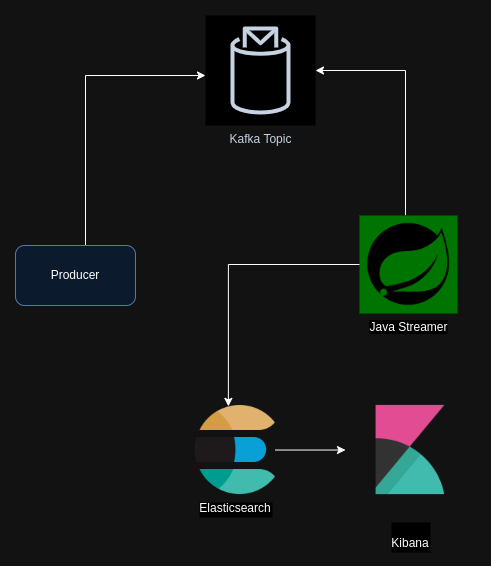

# Data Streaming with Kafka

## Description

This project demonstrates an architecture that collects, processes, and transforms movie data from Wikipedia (https://github.com/prust/wikipedia-movie-data). The list of movies is sent to a Kafka topic, then the data is consumed by a Spring Boot application, which processes it by removing certain attributes from the JSON. Finally, the processed data is sent to Elasticsearch, where it can be analyzed using Kibana.

The project follows the architecture illustrated below:



## Technologies

This project uses the following technologies:

- [Python](https://www.python.org/)
- [Kafka](https://kafka.apache.org/)
- [Spring Boot](https://spring.io/projects/spring-boot)
- [Elasticsearch](https://www.elastic.co/pt/elasticsearch)
- [Kibana](https://www.elastic.co/pt/kibana)
- [Maven](https://maven.apache.org/)

## How to run the project

Start the containers with the command:

```bash
$ docker-compose up -d
```

Open Kafka-UI at http://localhost:8080 and create the topic "movies".

Next, download the dependencies of the Java project. Inside the "java-streamer" folder, run:

```bash
$ mvn clean install
```

Run the application with your favorite IDE or use the command: 

```bash
$ mvn spring-boot:run
```

Send messages to Kafka using the Python script (inside the "producer" folder):

```bash
$ python3 -m venv .venv
$ source .venv/bin/activate
$ python3 -m pip install -r requirements.txt
$ python3 script.py
```

**Create an Index Pattern in Kibana:**

Access http://localhost:5601
- Navigate to Index Patterns: In Kibana, go to Management > Stack Management > Kibana > Index Patterns.
- Create Index Pattern: Click on Create index pattern and enter movies-index (or the name of your index). Click Next step.
- Select Time Field: If your data contains a timestamp field, select it as the time field. If not, you can proceed without selecting a time field.
- Create Index Pattern: Click on Create index pattern to finalize

**Visualize Your Data:**

- Discover: Go to Discover in the left navigation panel. Select your newly created index pattern from the dropdown.
- View Documents: You should now be able to see the documents indexed in Elasticsearch. You can search, filter, and visualize the JSON data stored in your movies-index.
